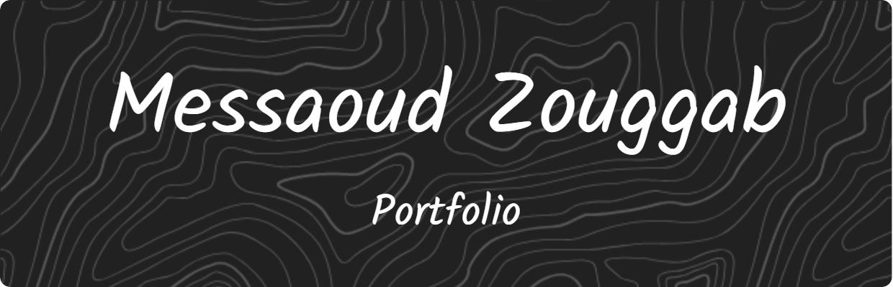
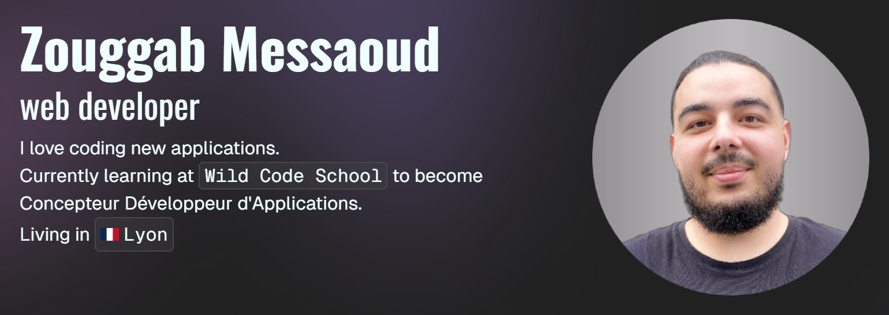

# My Portfolio 👨🏻‍💻

(**In progress**, still working on it...)

## Overview 🔬

# Launch project 🚀

- Clone the repo, and enter in it.

- `npm install` or `pnpm install` in the root directory to install dependancies.

- `npm run dev` or `pnpm run dev` in the root directory.

- Open [http://localhost:3000](http://localhost:3000) with your browser to see the result.

# Tools 🛠️ 🪛 🪚

- [Next.js](https://nextjs.org/docs)
- [TypeScript](https://www.npmjs.com/package/typescript)
- [Tailwind](https://www.npmjs.com/package/tailwindcss)
- [Shadcn/ui](https://ui.shadcn.com/)
- [Google Fonts](https://nextjs.org/docs/basic-features/font-optimization)
- [ESLint](https://eslint.org/)

## Contributing 🛟

If you'd like to contribute to my *Portfolio*, feel free to submit a *Issues*. I welcome your ideas and enhancements!